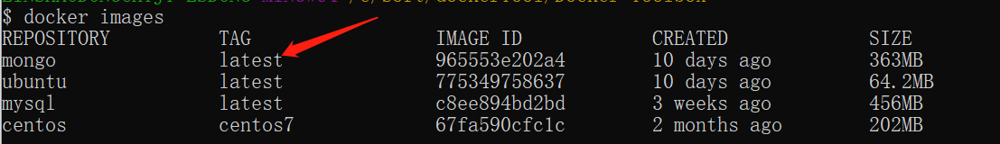
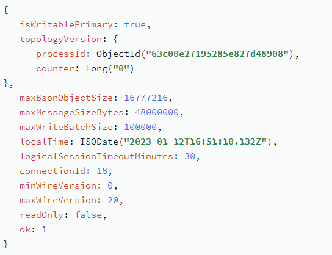

# How to Install MongoDB on Docker

## **Prerequisites:：**
1.Install Docker Desktop.
2.Install mongosh or install it later in Docker using code (without manually locating the software).

## **Step**

### **1.Pull a MongoDB Docker Image**

*docker pull mongodb/mongodb-community-server:latest*

Viewing the local image
Use the following command to see if mongo is installed:

*$ docker images*

### **2.Run the image as a container**

*docker run -d -p 27017:27017 --name my-mongo-container mongo*

Parameter description:

-d: Runs the container in the background.
-p 27017:27017: Maps host port 27017 to container port 27017.
--name my-mongo-container: Specify a name for the container, in this case my-mongo-container, which you can change as needed.

For example, to run MongoDB 5.0, do the following:

*docker run --name mongodb -p 27017:27017 -d mongodb/mongodb-community-server:5.0-ubuntu2004*

### 3.Check that the container is running

To check the status of the Docker container, run the following command:

*docker container ls*

The output of the ls command lists containers that describe what is running, for example:

*Container ID*

*Image*

*Command*

*Created*

*Status*

*Port*

*Names*

### 4. Use mongosh

*mongosh --port 27017*

### 5.Validate

To confirm that the MongoDB instance is running, run the Hello command:

*db.runCommand(*
 *{*
 *hello: 1*
 *}*
*)*

The result of this command returns a document describing the mongod deployment:

At this point you should see the MongoDB container named *my-mongo-container* running.

### 6.Connecting to MongoDB Applications

Next we can use a MongoDB application (e.g. mongo shell) to connect to a running MongoDB container.

You can use the following command to connect to MongoDB:

*$ mongosh --host 127.0.0.1 --port 27017*

This will connect to port 27017 on the localhost, which you can adjust based on the previously mapped port.

The bash shell command to enter the MongoDB container is as follows:

*docker exec -it my-mongo-container bash*

To stop and delete containers when they are no longer needed, you can use the following commands:

*docker stop my-mongo-container*

*docker rm my-mongo-container*